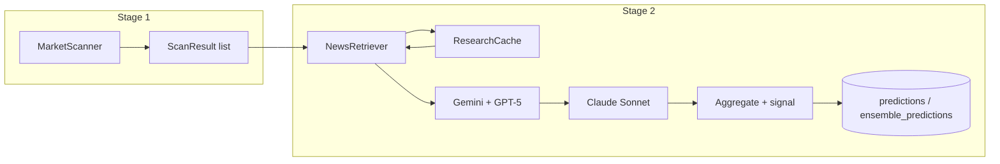

# Lloyd Stage 2 — Research & Prediction Pipeline

## Summary

Stage 2 consumes the ranked `ScanResult` list from the scanner, fetches news context (GDELT + RSS) with a 2h cache, runs a tiered LLM ensemble (Tier 1: Gemini + GPT-5; Tier 2: Claude Sonnet on escalation), aggregates with trimmed mean and market-conditioned blend, assigns trade signals, and persists predictions and ensemble results to SQLite. No changes to Stage 1 scanner or scheduler logic except wiring the pipeline after each scan.

## Architecture (high level)

---

## 1. `lloyd/common/rate_limiter.py` (new)

**Purpose:** Shared token-bucket rate limiter; callers await `acquire()` before each LLM API call to stay under provider limits.

**Classes / functions:**

- `RateLimiter(calls_per_minute: int)` — token bucket state (tokens, last refill time).
- `async def acquire(self) -> None` — refill bucket by elapsed time; if no token available, sleep until one is; then consume one.
- Module-level constants: `GEMINI_LIMITER = RateLimiter(14)`, `OPENAI_LIMITER = RateLimiter(50)`, `ANTHROPIC_LIMITER = RateLimiter(50)`.

**Design:**

- Use `asyncio`-friendly sleep (no blocking). One bucket per limiter instance; predictors hold a reference and call `await limiter.acquire()` before each request.
- Refill: `tokens = min(calls_per_minute, tokens + (now - last_refill) * (calls_per_minute / 60))`; then if `tokens < 1`, sleep for `(1 - tokens) * (60 / calls_per_minute)` seconds, set tokens to 0, then continue.

**Unclear / choices:** None. Straightforward token bucket.

---

## 2. `lloyd/prediction/prompts/templates.py` (new)

**Purpose:** Single base prompt with a `{category_guidance}` slot filled from a lookup; formats news for the prompt and handles “no context” explicitly.

**Content:**

- `CATEGORY_GUIDANCE: dict[str, str]` — keys: `weather`, `entertainment`, `politics`, `sports`, `default`; map to one-sentence framing. Use `default` for `world_events`, `crypto`, `finance`, and `None`.
- `PROMPT_VERSION = "v1.0"`.
- `def format_news_context(bundle: NewsBundle) -> str` — if `context_quality == 'none'`, return the fallback string; else numbered list of articles (title, source, date, snippet, url).
- `def build_prompt(market: Market, bundle: NewsBundle, category_guidance: str) -> tuple[str, str]` — returns `(system_prompt, user_prompt)`. Fill: `market_question` (from `market.question`), `resolution_criteria`, `current_price`, `days_remaining`, `category`, `category_guidance`, `news_context`.

**Design:**

- **Resolution criteria:** `Market` has no `resolution_criteria`. Use `market.raw_data.get("description")` or `market.raw_data.get("resolutionCriteria")` if present (Polymarket), else `"Per market rules."` (Kalshi has no description in current parser).
- **Days remaining:** Compute in `build_prompt`: `(market.close_date - now).days` with tz-aware `now`; if `close_date` is None, use a placeholder (e.g. `"Unknown"` or skip the line).
- **Category for guidance:** `category_guidance = CATEGORY_GUIDANCE.get(market.category or "default", CATEGORY_GUIDANCE["default"])`.

**Unclear:** None. Optional: add `world_events` / `crypto` / `finance` entries to `CATEGORY_GUIDANCE` later.

---

## 3. DB schema additions in `lloyd/db.py` + `lloyd/research/cache.py`

### 3a. `lloyd/db.py` (modify)

**Purpose:** Add three tables and keep existing schema/init/insert logic unchanged.

**Changes:**

- Append to `SCHEMA` the three `CREATE TABLE IF NOT EXISTS` blocks for `research_cache`, `predictions`, `ensemble_predictions` exactly as specified (including `UNIQUE(market_id, query_hash)` on `research_cache`).
- Add `get_market_id(conn: sqlite3.Connection, market: Market) -> int | None` that returns `_resolve_market_id(conn, market)` so pipeline and cache callers can resolve `market_id` without touching private API.
- Add `insert_predictions(conn, predictions: list[PredictionResult], market_id: int)` and `insert_ensemble_predictions(conn, ensemble_list: list[EnsemblePrediction])`. For `ensemble_predictions`, store `model_predictions` as JSON; for `predictions`, map `PredictionResult` fields to columns (including `context_quality`, `input_context_hash`, `prompt_version`).

**Design:**

- `init_db(conn)` already runs `conn.executescript(SCHEMA)`; adding to `SCHEMA` is enough for new tables.
- Prediction models (`PredictionResult`, `EnsemblePrediction`) live in `lloyd/prediction/`; db layer will need to import them or accept dicts. Prefer importing from `lloyd.prediction.llm` and `lloyd.prediction.ensemble` to keep types consistent; avoid circular imports by having db import only when defining insert functions (or pass row tuples from prediction module). Recommended: define `PredictionResult` / `EnsemblePrediction` in prediction module; in db.py add `insert_predictions` / `insert_ensemble_predictions` that take the Pydantic models and convert to rows (db imports prediction models).

**Unclear:** Confirm whether `ensemble_predictions.model_predictions` stores full `PredictionResult` objects as JSON or a minimal list of dicts; spec says “JSON array of individual prediction records” — store serialized `PredictionResult` list for full provenance.

### 3b. `lloyd/research/cache.py` (new)

**Purpose:** Read/write wrapper for `research_cache` table; 2h TTL; used by news retriever via pipeline.

**Classes / functions:**

- `ResearchCache`:
  - `__init__(self, conn: sqlite3.Connection)` — hold reference to conn (caller manages lifecycle).
  - `get(self, market_id: int, query_hash: str) -> NewsBundle | None` — SELECT by (market_id, query_hash); if row exists and `expires_at > now`, deserialize `articles` JSON and `context_quality`/`article_count` into `NewsBundle`, return it; else delete expired row if present and return None.
  - `set(self, market_id: int, query_hash: str, bundle: NewsBundle) -> None` — INSERT or REPLACE with `fetched_at = now`, `expires_at = now + LLOYD_NEWS_CACHE_TTL_HOURS` (from config); serialize `bundle.articles` to JSON.
  - `hash_query(self, question: str) -> str` — public method; SHA256 of `question.lower().strip()` (hex digest). Pipeline calls this directly.

**Design:**

- Cache is synchronous (no async); pipeline calls it from async code (no need to run in executor for quick DB ops). TTL hours from config (default 2).
- `research_cache` has `UNIQUE(market_id, query_hash)` so use `INSERT OR REPLACE` or `INSERT ... ON CONFLICT DO UPDATE` for `set`.

**Unclear:** None.

---

## 4. `lloyd/research/news.py` (new)

**Purpose:** Fetch news for a market from GDELT and RSS concurrently; dedupe; score context quality; return `NewsBundle`.

**Data structures:**

- `Article` dataclass: `title`, `source`, `published_at`, `snippet`, `url`, `sentiment_score: float | None`.
- `NewsBundle` dataclass: `articles: list[Article]`, `context_quality: str`, `article_count: int`.

**Classes / functions:**

- `NewsRetriever`:
  - `async def fetch(self, market: Market) -> NewsBundle` — `keywords = _extract_keywords(market.question)` (returns `list[str]`); run `_fetch_gdelt(" ".join(keywords))` and `_fetch_rss(keywords)` with `asyncio.gather`; merge and `_deduplicate`; cap total 25; set `context_quality = _score_quality(articles)`; return `NewsBundle(articles, context_quality, len(articles))`.
  - `async def _fetch_gdelt(self, query: str) -> list[Article]` — GET `https://api.gdeltproject.org/api/v2/doc/doc?query={query}&mode=artlist&maxrecords=25&timespan=7d&format=json` with httpx; on HTTP error or malformed JSON log and return `[]`; parse `articles` (or top-level list if that’s the shape); map to `Article` (e.g. `seendate` → `published_at`, `tone` → `sentiment_score`, domain/source → `source`); return list.
  - `async def _fetch_rss(self, keywords: list[str]) -> list[Article]` — load feed URLs from config (`LLOYD_RSS_FEEDS`); for each URL run `asyncio.to_thread(feedparser.parse, url)`; collect entries; filter where ≥2 keywords appear in (title + description) (case-insensitive); map to `Article`; sort by date; take 25 across all feeds.
  - `def _extract_keywords(self, question: str) -> list[str]` — strip punctuation, lowercase, remove stopwords (small built-in set: the, a, an, is, are, will, be, to, of, in, on, at, by, for); return list of tokens only. Callers that need a query string do `" ".join(keywords)` at the call site.
  - `def _deduplicate(self, articles: list[Article]) -> list[Article]` — use `rapidfuzz.fuzz.token_sort_ratio` on titles; if pair ratio > 85, keep first; order preserved.
  - `def _score_quality(self, articles: list[Article]) -> str` — `'good'` if len ≥ 5, `'partial'` if 1–4, `'none'` if 0.

**Design:**

- GDELT: spec says “articles array”; if API returns a different key (e.g. `ArticleList`), parse that; if `tone` is missing use `sentiment_score=None`.
- RSS: `feedparser` is sync; wrap each `feedparser.parse(url)` in `asyncio.to_thread` and run fetches concurrently (e.g. gather over feeds). Use httpx for actual HTTP if feedparser needs URL (feedparser can take URL and fetch internally in thread).
- Keyword extraction: returns `list[str]` only; GDELT call site uses `" ".join(keywords)`; RSS uses the list for the 2-keyword relevance filter.
- **Dependency:** Add `feedparser` to pyproject.toml; httpx already present for GDELT.

**Unclear:** GDELT JSON shape (articles vs ArticleList) — implement defensive parsing and log on unexpected shape; tests use a “realistic mocked JSON” per spec.

---

## 5. `lloyd/prediction/llm.py` (new)

**Purpose:** Abstract predictor interface and three implementations (Gemini, GPT-5, Claude Sonnet); rate limiting before each call; return `PredictionResult` or `None` on failure.

**Models:**

- `PredictionResult` (Pydantic): `model_name`, `probability` (0 < x < 1), `confidence` (1–5), `reasoning`, `evidence_for`, `evidence_against`, `market_disagree_reason`, `tokens_used`, `cost_usd`, `prompt_version`, `context_quality`, `input_context_hash`.

**Classes / functions:**

- `Predictor` (ABC):
  - `async def predict(self, market: Market, bundle: NewsBundle) -> PredictionResult | None`.
  - `def _parse_response(self, raw: str) -> dict` — `json.loads(raw)`; validate required keys; raise `ValueError` if invalid or missing; return dict (caller builds `PredictionResult`).
  - `def _calculate_cost(self, tokens_used: int) -> float` — abstract or override (subclass-specific).
- `GeminiPredictor(Predictor)` — uses `google-generativeai`; model name from config `LLOYD_GEMINI_MODEL`; structured output (JSON); `await GEMINI_LIMITER.acquire()` then call; cost 0.0; on any exception log and return None.
- `GPT5Predictor(Predictor)` — uses `openai`; model from config `LLOYD_GPT5_MODEL`, fallback `LLOYD_GPT5_FALLBACK_MODEL`; `response_format={"type": "json_object"}`; `await OPENAI_LIMITER.acquire()`; on model-not-found retry once with fallback model and log warning; cost from `prompt_tokens`/`completion_tokens` and config per-1K rates.
- `ClaudeSonnetPredictor(Predictor)` — uses `anthropic`; model name from config (e.g. `LLOYD_CLAUDE_MODEL`); request JSON in system prompt; no native JSON mode; `await ANTHROPIC_LIMITER.acquire()`; cost from `input_tokens`/`output_tokens` and config.

**Design:**

- All predictors: catch API errors and JSON parse errors; return `None`; log with structlog (model, error type, market question truncated to 80 chars).
- `input_context_hash`: SHA256 of `system_prompt + user_prompt` (e.g. utf-8), hex digest; set when building `PredictionResult`.
- Token counts: Gemini may expose token usage in response; if not, set `tokens_used=0` and `cost_usd=0.0`. GPT and Claude use response usage fields.
- **SDK vs raw httpx:** Spec says “maintain raw httpx” for Stage 1; Stage 2 explicitly asks for SDKs (anthropic, openai, google-generativeai). So use SDKs for LLM calls only.

**Unclear:** None. Model strings live in config (`LLOYD_GEMINI_MODEL`, `LLOYD_GPT5_MODEL`, `LLOYD_GPT5_FALLBACK_MODEL`); Claude can use a literal or a config var if added later.

---

## 6. `lloyd/prediction/ensemble.py` (new)

**Purpose:** Orchestrate the full pipeline for a list of `ScanResult`: cache-aware news fetch, tiered LLM runs, aggregation, trade signal, and DB persistence.

**Models:**

- `EnsemblePrediction` (Pydantic): `market_id`, `ensemble_probability`, `market_price`, `edge`, `alpha`, `final_probability`, `model_predictions: list[PredictionResult]`, `trade_signal`, `tier2_used`.

**Classes / functions:**

- `EnsemblePipeline`:
  - `__init__(self, conn: sqlite3.Connection, settings: Settings)` — hold conn, settings; create `ResearchCache(conn)`, `NewsRetriever(settings)`, predictors (Gemini, GPT-5, Claude), load thresholds from settings.
  - `async def run(self, candidates: list[ScanResult]) -> list[EnsemblePrediction]` — for each candidate: get the `Market` from the candidate (see **ScanResult field** below); `market_id = get_market_id(conn, market)`; if None skip; `query_hash = cache.hash_query(market.question)`; `bundle = cache.get(market_id, query_hash)`; if bundle is None `bundle = await retriever.fetch(market)` and `cache.set(market_id, query_hash, bundle)`; run Tier 1 (Gemini + GPT-5) with `asyncio.gather`; if `_should_escalate(tier1_results, market_price)` run Tier 2 (Claude); collect all non-None results; if all None log warning and skip; else `ep = _aggregate(...)`; persist predictions and ensemble row; append ep to list. After the loop set `self._last_run_cost = <sum of all PredictionResult.cost_usd for the batch>`, then log batch summary (predictions count, tier2_used count, total_cost_usd, buy_yes/buy_no/no_trade counts). Return list of `EnsemblePrediction` only.
  - `async def _run_tier1(self, market: Market, bundle: NewsBundle) -> list[PredictionResult | None]` — `asyncio.gather(gemini.predict(...), gpt5.predict(...))`.
  - `async def _run_tier2(self, market: Market, bundle: NewsBundle) -> PredictionResult | None` — return `await claude.predict(...)`.
  - `def _should_escalate(self, tier1_results: list[PredictionResult | None], market_price: float) -> bool` — True if any non-None result has `|probability - market_price| > LLOYD_TIER1_ESCALATION_THRESHOLD` (0.05).
  - `def _aggregate(self, results: list[PredictionResult], market_price: float, model_weights: dict[str, float] | None = None) -> EnsemblePrediction` — if no weights, equal weights; trimmed mean: if len(results) ≥ 3 drop min and max then mean, else mean of all; `edge = trimmed_mean - market_price`; `alpha = settings.LLOYD_MARKET_CONDITIONED_ALPHA`; `final_probability = (1 - alpha) * market_price + alpha * trimmed_mean`; trade_signal: if `edge > MIN_EDGE_THRESHOLD` then `'buy_yes'`, elif `edge < -MIN_EDGE_THRESHOLD` then `'buy_no'`, else `'no_trade'`. Return `EnsemblePrediction` (include `market_id` — caller must pass it in; so signature could be `_aggregate(self, market_id: int, results: list[PredictionResult], market_price: float, tier2_used: bool, model_weights=...)`).

**Design:**

- **Alpha:** Stored as ensemble weight (0.3); `final = (1 - alpha) * market_price + alpha * ensemble_probability`; document in docstring and in config comment.
- **market_id in EnsemblePrediction:** Pipeline has market_id when calling _aggregate; add `market_id` to `_aggregate` args and set on `EnsemblePrediction`.
- **Persistence:** Pipeline calls `insert_predictions(conn, list_of_PredictionResult, market_id)` and `insert_ensemble_predictions(conn, [ep])` after each market (or batch at end; spec says “Store … to DB” — per-market is simpler and gives incremental progress).
- **Cost:** Accumulate sum of `PredictionResult.cost_usd` for the batch inside `run()`; after the loop set `self._last_run_cost = <that sum>` (default 0.0 on pipeline instance). Main reads `pipeline._last_run_cost` for the summary log.
- **ScanResult field:** Before writing the pipeline, confirm in [lloyd/common/models.py](lloyd/common/models.py) the exact attribute name on `ScanResult` that holds the `Market` object. The codebase uses `**market`** (i.e. `ScanResult.market`). Use that name in the pipeline — do not assume.

**Unclear:** None. Optional: batch DB writes at end for fewer commits; plan uses per-market writes for clarity and crash safety.

---

## 7. `lloyd/config.py` (modify)

**Purpose:** Add Stage 2 env vars for LLM keys, cost constants, thresholds, and research (RSS feeds, cache TTL).

**Add (all under existing `Settings`):**

- API keys: `LLOYD_OPENAI_API_KEY`, `LLOYD_ANTHROPIC_API_KEY`, `LLOYD_GOOGLE_AI_API_KEY` (str, default `""`).
- Model strings (so a broken model id is a config fix, not a code deploy): `LLOYD_GEMINI_MODEL: str = "gemini-2.5-pro"`, `LLOYD_GPT5_MODEL: str = "gpt-5"`, `LLOYD_GPT5_FALLBACK_MODEL: str = "gpt-4o"`. Claude predictor uses a model id from config as well (e.g. add `LLOYD_CLAUDE_MODEL: str = "claude-sonnet-4-20250514"` so all three predictors read from config).
- Cost (float): `LLOYD_GPT5_INPUT_COST_PER_1K`, `LLOYD_GPT5_OUTPUT_COST_PER_1K`, `LLOYD_CLAUDE_INPUT_COST_PER_1K`, `LLOYD_CLAUDE_OUTPUT_COST_PER_1K` (defaults as specified).
- Thresholds: `LLOYD_MIN_EDGE_THRESHOLD`, `LLOYD_TIER1_ESCALATION_THRESHOLD`, `LLOYD_MARKET_CONDITIONED_ALPHA`.
- Research: `LLOYD_RSS_FEEDS: list[str] = []`, `LLOYD_NEWS_CACHE_TTL_HOURS: int = 2`.

**Design:**

- `LLOYD_RSS_FEEDS`: Env is a single string (newline-separated URLs). Use a Pydantic validator/serializer: if the field is defined as `str` in env, then `@field_validator('LLOYD_RSS_FEEDS', mode='before')` that splits by `\n`, strips, and filters empty; or define as `str` and add a property `def rss_feed_list(self) -> list[str]`. Cleanest: define type as `list[str]` and use a validator that accepts str and splits. Pydantic v2: `Union[str, list[str]]` with validator normalizing to list.
- Document alpha in a comment: “Ensemble weight in final blend: final = (1 - alpha)*market_price + alpha*ensemble_estimate.”

**Unclear:** None.

---

## 8. `lloyd/main.py` (modify)

**Purpose:** After scanner and DB writes for markets/scan_results/pairs, run Stage 2 and log summary.

**Changes:**

- After `insert_scan_results` (and `insert_market_pairs`), before `print_summary`, get `EnsemblePipeline(conn, settings)` and run `ensemble_results = await pipeline.run(results)` (keep conn open for pipeline).
- Log one line: `stage_2_complete | predictions={len(ensemble_results)} | tier2_used={sum(1 for e in ensemble_results if e.tier2_used)} | total_cost_usd={pipeline._last_run_cost} | buy_yes={n} | buy_no={n} | no_trade={n}`. Read total cost from `pipeline._last_run_cost` (set by `run()` after the loop).
- Do not change scheduler interval or Stage 1 logic.

**Design:**

- Pipeline needs conn; conn is open in the same `try` block. Pass `conn` and `settings` into `EnsemblePipeline`; call `await pipeline.run(results)`; then `print_summary` and `conn.close()` in `finally`.
- `run()` returns `list[EnsemblePrediction]` only. Total cost is stored on the pipeline as `self._last_run_cost` (accumulated in `run()`, set after the loop completes). Main reads `pipeline._last_run_cost` for the summary log.

**Unclear:** None.

---

## 9. New dependencies (`pyproject.toml`)

Add to `dependencies`:

- `anthropic`
- `openai`
- `google-generativeai`
- `feedparser`

`rapidfuzz` already present (dedupe in news). No Reddit/asyncpraw.

---

## 10. Stub replacements

- `lloyd/research/__init__.py`: Export `NewsRetriever`, `NewsBundle`, `Article` (and `ResearchCache` if desired).
- `lloyd/prediction/__init__.py`: Export `EnsemblePipeline`, `EnsemblePrediction`, `Predictor`, `PredictionResult`, and concrete predictor classes if useful for tests.
- `lloyd/prediction/prompts/__init__.py`: Create; export `build_prompt`, `format_news_context`, `PROMPT_VERSION`, `CATEGORY_GUIDANCE`.

---

## 11. Tests (planned)

- **test_news.py:** Keyword extraction returns list[str] (punctuation stripped, stopwords removed). GDELT parsing with mocked JSON (realistic shape). RSS relevance: 2-keyword threshold (1 keyword excluded). Dedupe: two headlines with token_sort_ratio > 85 → one. GDELT HTTP 500 → empty list, no raise. Context quality: 0 → `'none'`, 3 → `'partial'`, 7 → `'good'`.
- **test_llm.py:** Mock SDKs. `_parse_response` valid JSON → dict; malformed → None (or raise caught); missing required keys → None. Cost calculation GPT-5 and Claude with known tokens and config. RateLimiter.acquire called exactly once per predict(). GPT-5 fallback to gpt-4o on model-not-found.
- **test_ensemble.py:** `_should_escalate`: both within 5pp → False; one diverges 6pp → True; both None → False. `_aggregate`: 3 results → trimmed mean (high/low dropped); 2 → mean; 1 → that value. Trade signal: edge +0.04 → buy_yes, -0.04 → buy_no, +0.02 → no_trade. All models None → market skipped (no DB write).
- **test_prompts.py:** `build_prompt` contains market question, current price, category guidance. `format_news_context` non-empty → numbered list; empty / context_quality 'none' → fallback string. `PROMPT_VERSION` present in built prompt.

**Design:** Use pytest and pytest-asyncio; mock httpx for GDELT and SDK clients for LLM tests; in-memory SQLite for cache/DB tests where needed.

---

## Build order (dependency order)

1. **rate_limiter.py** — no deps on other Stage 2 code.
2. **prompts/templates.py** — needs `Market`, `NewsBundle` (define `NewsBundle`/`Article` in research first or in a shared place; minimal: define `NewsBundle` in research/news.py and import in prompts, or define a small types module; spec puts NewsBundle in news.py so prompts will import from research.news — ensure research/news.py exists before prompts that reference NewsBundle; so either implement a minimal NewsBundle in common or implement news.py before prompts. Build order says prompts before research/cache and news; so prompts need NewsBundle — options: (a) define Article/NewsBundle in common/models.py, or (b) define in research/news.py and do prompts after news. Spec says “Build in this dependency order … 2. prompts/templates.py” and “4. lloyd/research/news.py”. So prompts come before news; hence prompts cannot import NewsBundle from news. So define NewsBundle (and Article) in a place that prompts can import: e.g. `lloyd/common/models.py` (add Article, NewsBundle) or a new `lloyd/research/types.py` with just dataclasses. Preferred: add `Article` and `NewsBundle` to `lloyd/common/models.py` so both research and prediction can use them without circular deps; then prompts only need Market from common and NewsBundle from common.
3. **DB schema (db.py) + research/cache.py** — cache uses conn and research_cache table; cache can depend on NewsBundle from common.
4. **research/news.py** — uses Article, NewsBundle (common), cache (optional; pipeline uses cache, news doesn’t need to know cache).
5. **prediction/llm.py** — uses rate_limiter, prompts (for build_prompt), Market, NewsBundle.
6. **prediction/ensemble.py** — uses pipeline, cache, news, llm, db (get_market_id, insert_*).
7. **config.py** additions.
8. **main.py** wiring.
9. **Tests** for each module.

**Clarification:** Put `Article` and `NewsBundle` in `lloyd/common/models.py` so prompt templates can reference `NewsBundle` before `news.py` exists. Then build order 2 (prompts) is valid.

---

## Concerns and spec notes

1. **Resolution criteria / days_remaining:** Market has no `resolution_criteria`; plan uses `raw_data` and “Per market rules.” and computes days from `close_date`. If Polymarket/Kalshi add structured resolution later, we can extend Market or raw_data usage.
2. **GDELT response shape:** Plan assumes an `articles` array (or equivalent); implement defensive parsing and unit test with a documented mock shape; adjust after first real run if needed.
3. **RSS async:** Using `asyncio.to_thread(feedparser.parse, url)` is correct; feedparser does I/O inside so running in thread avoids blocking the event loop.
4. **DB imports prediction models:** `db.py` will import `PredictionResult` and `EnsemblePrediction` from prediction package for insert functions; ensure no circular import (db is not imported by llm.py or prompts; ensemble imports db; so db → prediction.llm and prediction.ensemble is OK).
5. **GPT-5 model name:** Spec says “gpt-5”; if the API uses a different id (e.g. “gpt-5-preview”), use config constant so it can be changed without code edit.
6. **Alpha documentation:** Document in code and config that alpha is the ensemble weight and final = (1-alpha)*market + alpha*ensemble.

---

## File checklist

| File                                                                           | Action                                                                     |
| ------------------------------------------------------------------------------ | -------------------------------------------------------------------------- |
| [lloyd/common/rate_limiter.py](lloyd/common/rate_limiter.py)                   | Create                                                                     |
| [lloyd/common/models.py](lloyd/common/models.py)                               | Add `Article`, `NewsBundle`                                                |
| [lloyd/prediction/prompts/**init**.py](lloyd/prediction/prompts/__init__.py)   | Create                                                                     |
| [lloyd/prediction/prompts/templates.py](lloyd/prediction/prompts/templates.py) | Create                                                                     |
| [lloyd/db.py](lloyd/db.py)                                                     | Add schema, get_market_id, insert_predictions, insert_ensemble_predictions |
| [lloyd/research/cache.py](lloyd/research/cache.py)                             | Create                                                                     |
| [lloyd/research/news.py](lloyd/research/news.py)                               | Create                                                                     |
| [lloyd/research/**init**.py](lloyd/research/__init__.py)                       | Replace stub                                                               |
| [lloyd/prediction/llm.py](lloyd/prediction/llm.py)                             | Create                                                                     |
| [lloyd/prediction/ensemble.py](lloyd/prediction/ensemble.py)                   | Create                                                                     |
| [lloyd/prediction/**init**.py](lloyd/prediction/__init__.py)                   | Replace stub                                                               |
| [lloyd/config.py](lloyd/config.py)                                             | Add Stage 2 settings                                                       |
| [lloyd/main.py](lloyd/main.py)                                                 | Wire pipeline after scan                                                   |
| [pyproject.toml](pyproject.toml)                                               | Add deps                                                                   |
| tests/test_news.py, test_llm.py, test_ensemble.py, test_prompts.py             | Create                                                                     |

