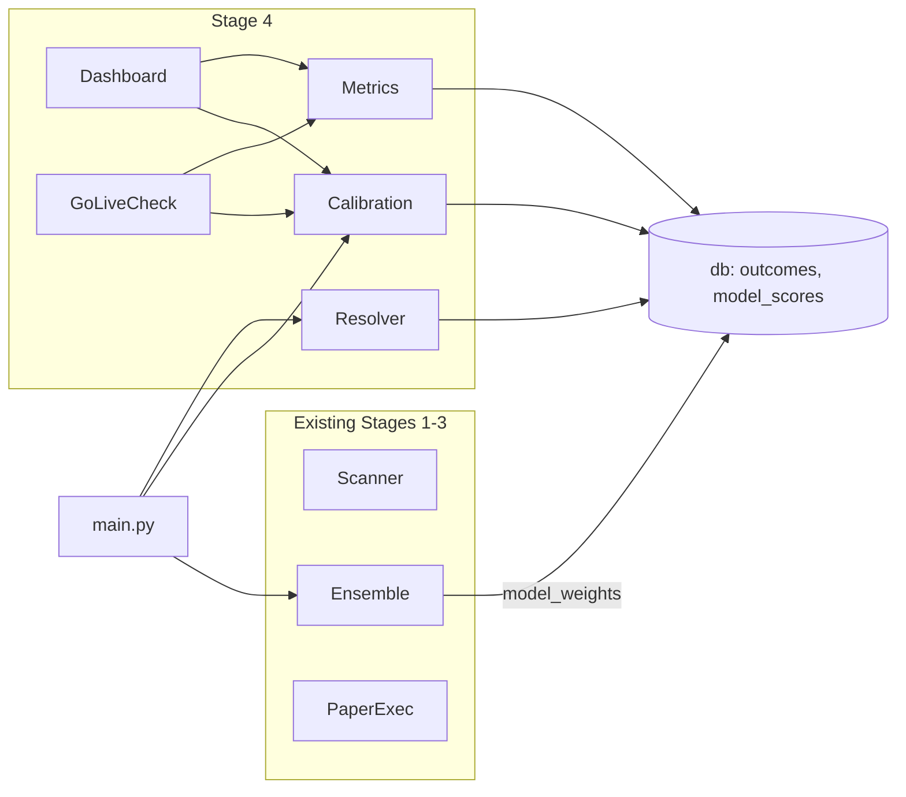

# Lloyd Stage 4 — Postmortem, Calibration, and Go-Live

## Architecture overview

- **Resolver** (every 15 min): polls Polymarket Gamma + Kalshi for resolved markets we have open trades on; writes `outcomes`, updates `trades.pnl` / `trades.status` / `trades.closed_at`.
- **Calibration** (daily 02:00 UTC): recomputes Brier and calibration error, writes `model_scores`; supplies `get_model_weights()` for the ensemble.
- **Metrics**: read-only aggregation over settled trades and model_scores; used by dashboard and go-live.
- **Dashboard** / **Go-live**: CLI entry points; no scheduler.

---

## 1. Database and config (foundation)

### 1.1 [lloyd/db.py](lloyd/db.py) — schema only

**What:** Add two tables to `SCHEMA` and run them via existing `init_db()` (no new init logic).

**Add to `SCHEMA` string (after `portfolio` table):**

- `outcomes`: `id`, `market_id` (FK → markets), `platform`, `outcome` ('yes'|'no'|'void'), `resolved_at`. No UNIQUE on `market_id` in schema; idempotency will be enforced in code by checking for an existing row before insert.
- `model_scores`: `id`, `model_name`, `category` (`''` empty string = overall; **not NULL** — SQLite treats each NULL as distinct in UNIQUE constraints, which would allow duplicate overall rows), `brier_score`, `calibration_error`, `num_predictions`, `period_start`, `period_end`, `category NOT NULL DEFAULT ''`, `UNIQUE(model_name, category, period_end)`.

**Design:** Keep all DB access synchronous (plain `sqlite3`) to match the rest of the codebase. No new public helpers in this file unless we later add a small `outcome_exists(conn, market_id)` helper for clarity in the resolver.

---

### 1.2 [lloyd/config.py](lloyd/config.py) — new settings

**What:** Add Stage 4 settings under the same `LLOYD_` prefix.

**Add to `Settings`:**

- `LLOYD_LOG_PATH: str = ""` — optional path to structlog JSON file for go-live stability (ERROR check).
- `LLOYD_MC_SIMULATIONS: int = 10_000` — Monte Carlo runs for drawdown.
- `LLOYD_MIN_BRIER_SAMPLE: int = 10` — min predictions before writing a `model_scores` row.
- `LLOYD_STABILITY_WINDOW_DAYS: int = 30` — window for stability check.
- `LLOYD_STABILITY_MIN_CYCLE_PCT: float = 0.95` — pass if ≥ 95% of expected scan cycles have a `scan_results` entry.

No validators needed unless we want to clamp `LLOYD_STABILITY_MIN_CYCLE_PCT` to 0–1 (optional).

---

## 2. Resolver — outcome tracking and trade settlement

### 2.1 [lloyd/postmortem/resolver.py](lloyd/postmortem/resolver.py)

**Purpose:** Poll Polymarket and Kalshi for newly resolved markets we have open trades on; record outcomes and settle those trades (update `pnl`, `status`, `closed_at`).

**Classes / functions:**

- **`ResolverResult`** (dataclass): `markets_resolved: int`, `trades_settled: int`, `total_pnl_realized: float`, `errors: list[str]`.
- **`OutcomeResolver`**:
  - `__init__(self, conn: sqlite3.Connection, settings: Settings)` — hold conn and settings; create an `httpx.AsyncClient` (or reuse if we inject clients) for Gamma and Kalshi.
  - `async def run(self) -> ResolverResult` — get open paper trades; collect distinct `(platform, platform_id)`; call `_fetch_polymarket_resolutions(platform_ids)` and `_fetch_kalshi_resolutions(platform_ids)` (each with try/except, append errors to result); for each resolved item map `(platform, platform_id)` → list of `market_id` with open trades (from same conn query); for each `market_id`: if outcome not already in `outcomes`, call `_record_outcome` then `_settle_trades`; accumulate counts and P&L into `ResolverResult`.
  - `async def _fetch_polymarket_resolutions(self, condition_ids: list[str]) -> list[dict]` — GET Gamma `https://gamma-api.polymarket.com/markets` with `resolved=true` and condition_ids (batch or one-by-one if API doesn't support multiple IDs). Filter response to entries with `resolution` in ("YES","NO","VOID"); normalize to lowercase; return list of `{platform_id, outcome, resolved_at}` (or include `platform="polymarket"`). If the Gamma API uses a different param (e.g. single `condition_id`), implement batching or per-id requests with rate awareness.
  - `async def _fetch_kalshi_resolutions(self, tickers: list[str]) -> list[dict]` — for each ticker (or batch if API allows), GET `{LLOYD_KALSHI_BASE_URL}/markets/{ticker}` (or trade-api path per existing [paper.py](lloyd/execution/paper.py)); if `status == "settled"`, read `result` ("yes"/"no"/"void"); normalize to lowercase; treat missing result or closed-without-result as void; return list of `{platform_id: ticker, outcome, resolved_at}`.
  - `def _record_outcome(self, market_id: int, platform: str, outcome: str, resolved_at: str) -> None` — `SELECT 1 FROM outcomes WHERE market_id = ?`; if row exists, return; else `INSERT INTO outcomes (market_id, platform, outcome, resolved_at) VALUES (...)`; commit.
  - `def _settle_trades(self, market_id: int, outcome: str) -> list[int]` — `SELECT id, direction, quantity, executed_price, fee FROM trades WHERE market_id = ? AND is_paper = 1 AND status = 'open'`; for each row compute `pnl = _calculate_pnl(...)`; `UPDATE trades SET pnl = ?, status = 'filled', closed_at = ? WHERE id = ?`; return list of trade IDs.
  - **`def _calculate_pnl(self, trade: dict, outcome: str) -> float`** — **P&L formulas.** Executed_price is the price paid per share (YES share for buy_yes, NO share for buy_no); each winning share pays $1.00 at resolution.
    - **buy_yes + outcome yes (win):** `(1.0 - executed_price) * quantity - fee`
    - **buy_yes + outcome no (loss):** `-executed_price * quantity - fee`
    - **buy_no + outcome no (win):** `(1.0 - executed_price) * quantity - fee` — for buy_no, executed_price is the NO share price (1 - final_probability); a NO share pays $1.00 when the event resolves NO.
    - **buy_no + outcome yes (loss):** `-executed_price * quantity - fee`
    - **void:** P&L = 0.
    - **Do not use** the incorrect derivation buy_no+no → (1 - (1-price))*q - fee = price*q - fee (that treats executed_price as YES price; it is not).

**Design choices:**

- Resolver owns its own `httpx.AsyncClient` (or receives clients in constructor) so it can run in the scheduler without depending on scanner clients.
- Map (platform, platform_id) → market_ids by querying: from open trades join markets on market_id, then group by (platform, platform_id). Same platform_id can appear for multiple `market_id` (different `fetched_at`); we record one outcome row per `market_id` that has open trades and we settle only trades for that `market_id`.
- All API errors caught per platform; log with structlog; append to `ResolverResult.errors`; do not raise so the other platform still runs.

**Edge cases / concerns:**

- **Partial fills:** Current schema has no partial fills; each trade has a single `quantity` and `executed_price`. So no change.
- **Fees:** Already stored per trade in `trades.fee`; use them in `_calculate_pnl`.
- **Gamma API:** If the documented API does not support `condition_ids` as a single list, plan to either pass one `condition_id` per request or discover the correct query param from Polymarket docs and document it in code.

---

## 3. Calibration — Brier and model weights

### 3.1 [lloyd/postmortem/calibration.py](lloyd/postmortem/calibration.py)

**Purpose:** Load resolved predictions (excluding void), compute Brier and decile calibration, write `model_scores`; expose `get_model_weights()` and calibration plot data for dashboard/go-live.

**Classes / functions:**

- **`CalibrationAnalyzer`**:
  - `__init__(self, conn: sqlite3.Connection, settings: Settings)`.
  - `def run(self) -> None` — for each (model_name, category) and for overall (category=`''`): load resolved predictions with `_load_resolved_predictions(model_name=..., category=..., days=None)` for all-time and `days=30` for rolling; if `len(predictions) < LLOYD_MIN_BRIER_SAMPLE`, skip (log debug); else compute `_brier_score`, `_calibration_error`, and `_write_scores(..., period_start, period_end)` with appropriate windows. Then call `flag_category_leaders()` and log.
  - `def _load_resolved_predictions(self, model_name: str | None = None, category: str | None = None, days: int | None = None) -> list[dict]` — SQL: join `predictions` (p) → `outcomes` (o) on `p.market_id = o.market_id` AND `o.outcome != 'void'`, join `markets` (m) on `p.market_id = m.id`; select `p.probability`, `o.outcome`, `p.model_name`, `m.category`, `p.created_at`; filter by `model_name` / `category` / `created_at >= (now - days)` if provided; return list of dicts with keys `probability`, `outcome`, `model_name`, `category`, `created_at`.
  - `def _brier_score(self, predictions: list[dict]) -> float` — `o = 1 if outcome == 'yes' else 0`; return `mean((p - o)^2)`.
  - `def _calibration_error(self, predictions: list[dict]) -> float` — **equal-width deciles**: bins [0–0.1), [0.1–0.2), …, [0.9–1.0]. For each bin: mean predicted prob, actual outcome rate (fraction of yes); calibration error = mean over non-empty bins of `|predicted_mean - actual_rate|`.
  - `def _calibration_plot_data(self, predictions: list[dict]) -> list[dict]` — same binning; return list of `{bin_label: str, predicted_mean: float, actual_rate: float, count: int}`.
  - `def get_model_weights(self) -> dict[str, float]` — query `model_scores` for rows where `category = ''` (overall sentinel) and `period_end` is the latest (e.g. `ORDER BY period_end DESC` per model, then take one row per model with latest period_end). Weight = `1 / brier_score`; normalize so sum = 1.0. If fewer than 2 models have scores, return equal weights (e.g. `{}` or a dict that ensemble will treat as "no weights" and fall back to current behavior).
  - `def _write_scores(self, model_name: str, category: str | None, brier: float, cal_error: float, n: int, period_start: str, period_end: str) -> None` — `INSERT INTO model_scores (...) ON CONFLICT(model_name, category, period_end) DO UPDATE SET ...` (SQLite: use `INSERT OR REPLACE` or explicit conflict handling depending on UNIQUE).
  - `def flag_category_leaders(self) -> list[dict]` — for each category with enough data, find model with lowest Brier; compute margin over next; return list of `{category, best_model, brier_score, margin_over_next}` where margin ≥ 0.02; log at INFO.

**Decile strategy:** Use **equal-width** bins (0–10%, 10–20%, …) so that dashboard bins are comparable across runs and interpretable. Equal-frequency would change bin boundaries each run and complicate the "predicted vs actual" narrative.

**Rolling 30-day:** `run()` writes two "types" of rows: all-time (`period_start` = earliest prediction in DB or a fixed past date, `period_end` = today) and rolling (`period_start` = today - 30 days, `period_end` = today). Both keyed by `(model_name, category, period_end)` so they coexist; dashboard can choose "overall" vs "rolling 30-day" by filtering on `period_start`/`period_end`.

---

## 4. Metrics — performance numbers (read-only)

### 4.1 [lloyd/postmortem/metrics.py](lloyd/postmortem/metrics.py)

**Purpose:** Compute win rate, ROI, pseudo-Sharpe, max drawdown, Monte Carlo drawdown, Kelly adherence, category breakdown; used by dashboard and go-live.

**Data structures:**

- **`PerformanceMetrics`** (dataclass): `win_rate`, `roi`, `pseudo_sharpe`, `max_drawdown_actual`, `max_drawdown_monte_carlo_p95`, `kelly_adherence_mae`, `num_settled_trades`, `total_realized_pnl`, `category_breakdown: list[dict]`, `computed_at: str`.

**Classes / functions:**

- **`MetricsCalculator`**:
  - `__init__(self, conn: sqlite3.Connection, settings: Settings)`.
  - `def compute(self, category: str | None = None) -> PerformanceMetrics` — load trades via `_load_settled_trades(category)`; compute each metric; build `PerformanceMetrics(..., computed_at=datetime.now(timezone.utc).isoformat())`.
  - `def _load_settled_trades(self, category: str | None) -> list[dict]` — join `trades` (t) → `markets` (m) on `t.market_id = m.id`, where `t.is_paper = 1` and `t.status = 'filled'`; optional filter `m.category = ?`; return list of trade dicts (include `pnl`, `closed_at`, `quantity`, `ensemble_prediction_id`, etc.).
  - `def _win_rate(self, trades: list[dict]) -> float` — fraction of trades with `pnl > 0`.
  - `def _roi(self, trades: list[dict]) -> float` — `sum(pnl) / LLOYD_PAPER_BANKROLL`.
  - **`def _pseudo_sharpe(self, trades: list[dict]) -> float`** — Annualize using the **actual observed period** only. Do not use 252 or any fixed trading-day assumption. Use this concrete formula:
    - `elapsed_years = (max(closed_at) - min(closed_at)).total_seconds() / (365.25 * 24 * 3600)`
    - If `elapsed_years <= 0` (e.g. all trades same day), return `0.0`.
    - `trades_per_year = len(trades) / elapsed_years`
    - `sharpe = mean(pnl) / stdev(pnl) * sqrt(trades_per_year)`
    - If fewer than 2 trades or stdev is 0, return `0.0`.
  - `def _max_drawdown(self, trades: list[dict]) -> float` — sort by `closed_at`; running cumulative P&L; peak-to-trough drop; return as positive fraction of bankroll (e.g. `max_dd / paper_bankroll`).
  - `def _monte_carlo_max_drawdown(self, trades: list[dict], n_simulations: int = 10_000, percentile: float = 95.0) -> float` — bootstrap: shuffle list of `pnl` values N times; for each permutation compute max drawdown (same cumulative logic); return percentile of that distribution. If `len(trades) < 50` return `0.0` (caller can treat as insufficient data).
  - `def _kelly_adherence(self, trades: list[dict]) -> float` — for each trade load linked `ensemble_predictions` row (edge, final_probability, trade_signal); recompute theoretical Kelly quantity using same formula as [sizer](lloyd/risk/sizer.py) with `LLOYD_PAPER_BANKROLL` as bankroll (we don't have historical bankroll per trade, so use constant); deviation = `|actual_qty - theoretical_qty| / theoretical_qty` when theoretical > 0; return mean of those deviations (MAE as fraction).
  - `def _category_breakdown(self) -> list[dict]` — group settled trades by category; for each category with ≥10 trades compute win_rate and ROI; return `[{category, win_rate, roi, num_trades}]`.

**Design:** Use constant `LLOYD_PAPER_BANKROLL` for Kelly theoretical size so we measure adherence to the formula (fraction of bankroll) rather than reconstructing historical balance. If we later add portfolio snapshots at trade open we could refine.

---

## 5. Dashboard — terminal + markdown export

### 5.1 [lloyd/postmortem/dashboard.py](lloyd/postmortem/dashboard.py)

**Purpose:** Rich terminal UI and optional markdown export for portfolio, open positions, P&L, Brier, calibration plot, today's trades, top wins/losses.

**Classes / functions:**

- **`Dashboard`**:
  - `__init__(self, conn: sqlite3.Connection, settings: Settings)` (or take config only and open conn internally).
  - `def render(self) -> None` — build layout with `rich.layout.Layout`: top row two columns (portfolio panel | overall P&L); then full-width open positions; then two columns (Brier table | calibration plot); then today's trades and top wins/losses. Call `rich.console.Console().print(layout)`.
  - `def export_markdown(self, path: str) -> None` — same data, output as markdown: `# Lloyd Performance Dashboard`, timestamp, then each section as markdown tables (no ANSI).
  - `def _portfolio_panel(self) -> rich.table.Table` — latest `portfolio` row: cash_balance, total_exposure, unrealized_pnl, realized_pnl, num_open_positions.
  - **`def _open_positions_panel(self) -> rich.table.Table`** — Open trades (from trades + markets). For current price: query latest `markets.current_price` for that market's `platform_id` **only if** `markets.fetched_at` is within the **last 2 hours** (staleness threshold — one full scan cycle). If the price is stale or missing, show "—" and **omit** that position from unrealized P&L in the overall P&L panel. Columns: question (truncate 55), platform, direction, quantity, executed_price, current_price (or "—"), unrealized_pnl (or "—"). **Known limitation:** Real-time pricing would require a live API call; the dashboard is DB-only and out of scope for live fetches.
  - `def _todays_trades_panel(self) -> rich.table.Table` — trades where opened_at or closed_at is today (UTC); columns: question, direction, quantity, executed_price, pnl (or "—" if open).
  - `def _overall_pnl_panel(self) -> rich.table.Table` — cumulative realized, unrealized (only from positions with non-stale prices), total, ROI%.
  - `def _brier_panel(self) -> rich.table.Table` — from `model_scores` (category = `''`, latest period_end per model): model name, overall Brier, rolling 30-day Brier, num_predictions, status ✓/✗ (Brier < 0.20 pass).
  - `def _calibration_plot(self) -> rich.text.Text` — use `CalibrationAnalyzer(conn, settings)._calibration_plot_data(all_resolved_predictions)`; one line per decile: e.g. `[60-70%] ████░░ predicted=0.65 actual=0.58 (n=12)`; color green if actual ≥ predicted, red otherwise (Rich Text with style).
  - `def _top_trades_panel(self, n: int = 5) -> rich.table.Table` — top N and bottom N by pnl (settled only); columns: question, platform, pnl, direction.

---

## 6. Go-live check — six criteria and verdict

### 6.1 [lloyd/postmortem/go_live_check.py](lloyd/postmortem/go_live_check.py)

**Purpose:** Evaluate six criteria; output pass/fail/insufficient_data and weakest suggestions; no scheduler.

**Data structures:**

- **`CriterionResult`** (dataclass): `name: str`, `passed: bool | None`, `value: float | None`, `threshold: float`, `detail: str`.
- **`GoLiveResult`** (dataclass): `go: bool`, `criteria: list[CriterionResult]`, `weakest: list[str]`, `evaluated_at: str`.

**Classes / functions:**

- **`GoLiveChecker`**:
  - `__init__(self, conn: sqlite3.Connection, settings: Settings)`.
  - `def run(self) -> GoLiveResult` — run each `_check_*`, collect `CriterionResult`; set `go = all(c.passed is True for c in criteria)` (any `False` or `None` → not go); compute `_weakest_criteria` for failing criteria; return `GoLiveResult`.
  - `def _check_brier(self) -> CriterionResult` — from `model_scores` (category = `''`, latest) get per-model Brier and num_predictions; compute ensemble effective Brier (weighted mean of Brier by current `get_model_weights()`); pass if effective Brier < 0.20 and total num_predictions ≥ 100.
  - `def _check_roi(self) -> CriterionResult` — `MetricsCalculator().compute().roi`; pass if > 0.
  - **`def _check_calibration_error(self) -> CriterionResult`** — **Use ensemble-level calibration only. Do not call `CalibrationAnalyzer._load_resolved_predictions()`** — that method reads from the `predictions` table (per-model raw probabilities). For go-live we must measure the ensemble's output. Implement a **separate** query: join `ensemble_predictions` (ep) → `outcomes` (o) on `ep.market_id = o.market_id` where `o.outcome != 'void'`; select `ep.final_probability`, `o.outcome`. Build a list of `{probability: final_probability, outcome}` and pass it to the same decile-based `_calibration_error` logic (e.g. call `CalibrationAnalyzer._calibration_error(list)` or a shared helper with that list). Pass if calibration error < 0.05. Per-model calibration in `calibration.py` stays as-is for diagnostics.
  - `def _check_sample_size(self) -> CriterionResult` — count `trades` where `is_paper=1`, `status='filled'`; pass if ≥ 100.
  - `def _check_drawdown(self) -> CriterionResult` — `MetricsCalculator().compute()` then `_monte_carlo_max_drawdown(..., percentile=95)`; if < 50 trades, return `passed=None`, detail "insufficient_data"; else pass if value < 0.30.
  - `def _check_stability(self) -> CriterionResult` — expected cycles = (30 days * 24 * 60) / `scan_interval_minutes`; count distinct "cycle windows" in last 30 days that have at least one `scan_results` row; pass if (actual / expected) ≥ 0.95. If `LLOYD_LOG_PATH` is set, check last 30 days of log file for ERROR-level lines; if any, fail; if no log path, skip log check and note in detail.
  - `def _weakest_criteria(self, results: list[CriterionResult]) -> list[str]` — among failed criteria, rank by distance to threshold (e.g. Brier 0.217 vs 0.20 is "closer" than 0.35); return human-readable suggestion strings (e.g. "Brier score is 0.217 (needs 0.20)…").

**Terminal output:** Use `rich` table and colors (green pass, red fail, yellow insufficient data); print the verdict and weakest criteria as in the spec.

---

## 7. Main and ensemble integration

### 7.1 [lloyd/main.py](lloyd/main.py) — modifications

**Async scheduler compatibility (resolver job):** Stage 3 uses **AsyncIOScheduler** only ([lloyd/main.py](lloyd/main.py): `from apscheduler.schedulers.asyncio import AsyncIOScheduler`). It does **not** use `BackgroundScheduler` or `BlockingScheduler`. If a blocking scheduler were used, async jobs would not run correctly without explicit wrapping (e.g. `asyncio.run(resolver.run())`), which can cause subtle bugs. For Stage 4: (1) Keep using AsyncIOScheduler. (2) Define the resolver job as an **async** function (e.g. `async def _resolver_job(): ...` that gets conn, builds `OutcomeResolver`, awaits `resolver.run()`, closes conn). (3) Schedule it with `scheduler.add_job(_resolver_job, 'interval', minutes=15)`. No `asyncio.run()` wrapper is needed — the scheduler runs inside `asyncio.run(_main())`, so async jobs execute natively. Document in a code comment: "Resolver job is async; requires AsyncIOScheduler (used in Stage 3)."

- **Resolver job:** Implement as in the paragraph above.
- **Calibration job:** `scheduler.add_job(calibration_run, 'cron', hour=2, minute=0)` (UTC); sync function that opens conn, `CalibrationAnalyzer(conn, settings).run()`, closes conn.
- **Model weights before ensemble:** In `run_scan_cycle()`, before `pipeline.run(results)`, call `CalibrationAnalyzer(conn, settings).get_model_weights()`; pass the returned dict into `pipeline.run(results, model_weights=weights)` (or equivalent; see ensemble change below).
- **CLI:** Do not add dashboard/go_live to the main parser; keep "scan" and "run". Entry points are `python -m lloyd.dashboard` and `python -m lloyd.go_live` via separate modules (below).
- **Config:** Main already uses `get_settings()`; no change except that new Stage 4 vars are available.

### 7.2 [lloyd/prediction/ensemble.py](lloyd/prediction/ensemble.py) — model weights

- **`run(self, candidates: list[ScanResult], model_weights: dict[str, float] | None = None) -> list[EnsemblePrediction]`** — add optional `model_weights`; pass it through to `_aggregate(..., model_weights=model_weights)`.
- **`_aggregate(..., model_weights: dict[str, float] | None = None)`** — **Explicit branching:**
  - **When `model_weights` is provided and has ≥2 keys:** Use a **pure weighted mean** of probabilities by `r.model_name` (weight = `model_weights.get(r.model_name, default)`; default = 1/N for names not in dict). **Do not apply trimming** — trimming exists for equal-weighted aggregation to reduce outlier impact; with Brier-derived weights, a high-error model is already down-weighted, and trimming on top would double-penalize it and could drop the most extreme good call.
  - **When `model_weights` is None or has fewer than 2 keys:** Keep the existing **trimmed-mean** logic (sorted, drop min/max when ≥3 models, then mean).
  - Document this branching in the docstring and in the plan so implementers do not assume trimming is applied when weights are supplied.

---

## 8. CLI entry points (thin wrappers)

- **[lloyd/dashboard.py](lloyd/dashboard.py)** (new file at package root): `if __name__ == "__main__":` parse argv for `--export <path>`; get conn and settings; instantiate `Dashboard` from `lloyd.postmortem.dashboard`; call `export_markdown(path)` if `--export` else `render()`. This enables `python -m lloyd.dashboard` and `python -m lloyd.dashboard --export out.md`.
- **[lloyd/go_live.py](lloyd/go_live.py)** (new file): `if __name__ == "__main__":` get conn and settings; `GoLiveChecker(conn, settings).run()`; print result using Rich (table + verdict + weakest). Enables `python -m lloyd.go_live`.

---

## 9. Postmortem package init

- **[lloyd/postmortem/__init__.py](lloyd/postmortem/__init__.py)** — replace stub with exports: `OutcomeResolver`, `ResolverResult`, `CalibrationAnalyzer`, `MetricsCalculator`, `PerformanceMetrics`, `Dashboard`, `GoLiveChecker`, `GoLiveResult`, `CriterionResult` (so tests and main can import from `lloyd.postmortem` if desired).

---

## 10. Tests (high level)

- **test_resolver.py:** (1) **`_calculate_pnl`:** Test all five cases with **explicit expected values** (no reference to the wrong formula price*q - fee). **buy_yes:** executed_price=0.60, quantity=100, fee=1 → yes: (1-0.6)*100 - 1 = 39; no: -0.6*100 - 1 = -61. **buy_no:** executed_price is the NO share price (e.g. 0.40). buy_no + no (win): (1.0 - 0.40)*100 - 1 = 59; buy_no + yes (loss): -0.40*100 - 1 = -41. **void:** P&L = 0. Assert these exact values (or equivalent with other numbers) so the wrong derivation is never reintroduced. (2) `_record_outcome` idempotency: insert twice for same market_id, assert one row. (3) Mock Gamma/Kalshi responses; assert resolver runs and settles trades; assert one platform failing doesn't block the other. (4) `_settle_trades`: assert `status='filled'`, `closed_at` set, `pnl` set.
- **test_calibration.py:** (1) `_brier_score`: e.g. all p=0.7, all yes → 0.09. (2) `_calibration_error`: perfectly calibrated set → 0; miscalibrated → positive. (3) `get_model_weights`: Brier [0.20, 0.25, 0.40] → weights inverse, sum 1. (4) Min sample: <10 predictions → no `model_scores` row. (5) Void excluded from Brier.
- **test_metrics.py:** (1) `_max_drawdown`: fixed P&L sequence → known drawdown. (2) `_monte_carlo_max_drawdown`: <50 trades → 0.0. (3) `_pseudo_sharpe`: <2 trades → 0.0; and test annualization using elapsed_years from min/max closed_at. (4) `_roi`: known sum/bankroll. (5) `_kelly_adherence`: one trade matching theoretical → MAE 0.
- **test_go_live_check.py:** (1) Each `_check_*` with DB fixtures for pass/fail. (2) **`_check_calibration_error`:** Fixture with ensemble_predictions + outcomes; assert pass/fail based on calibration of `final_probability` vs outcome. (3) Stability: 97% cycle coverage → pass, 90% → fail. (4) Drawdown with <50 trades → `passed=None`. (5) `_weakest_criteria`: ordering by distance to threshold. (6) `GoLiveResult.go` True only when all passed.

---

## Concerns and clarifications

1. **P&L and void:** Void is defined as realized P&L = 0; we do not add "refund" to `total_pnl_realized` in `ResolverResult`. Fee is still applied (trade row has fee); if we want void to be "refund minus fee" we could set `pnl = -fee` for void; spec says "P&L = 0" so we use 0.
2. **Monte Carlo and sample size:** Returning 0.0 when <50 trades avoids noisy percentiles; go-live drawdown criterion separately uses `insufficient_data` when <50 trades, so the two are consistent.
3. **Calibration bins:** Equal-width deciles (0–10%, …, 90–100%) are used so dashboard and calibration error are stable and comparable across runs.
4. **Stability "expected cycles":** Define one cycle per `scan_interval_minutes`; count windows (e.g. by floor(timestamp / interval_sec)) in the last 30 days; count how many windows have ≥1 row in `scan_results`; pass if ratio ≥ 0.95. Log check: if `LLOYD_LOG_PATH` is set, read file and look for ERROR; if not set, skip and note in output.
5. **Pattern compatibility:** Resolver and calibration use the same `get_connection` + `init_db` pattern; they do not modify scanner, research, prediction, or execution code paths. Only additions are: main jobs, ensemble `model_weights` usage, and two new tables. Existing tests remain untouched unless we add integration tests that run a full cycle.
6. **SQLite NULL in UNIQUE constraints:** SQLite treats each NULL as distinct in UNIQUE constraints. `UNIQUE(model_name, category, period_end)` would allow unlimited duplicate overall rows if category were NULL. Fix: use `category NOT NULL DEFAULT ''` in the schema. Use `''` (empty string) as the sentinel for "overall/cross-category" everywhere: `_write_scores`, `get_model_weights`, `_load_resolved_predictions`, `_brier_panel`, `_check_brier`, `flag_category_leaders`. Per-category rows use the real category string. All `IS NULL` checks become `= ''`.
